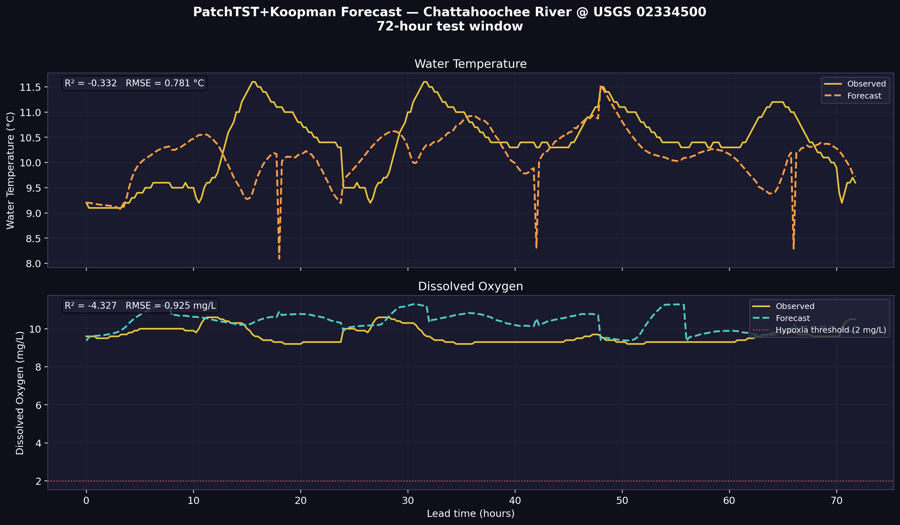
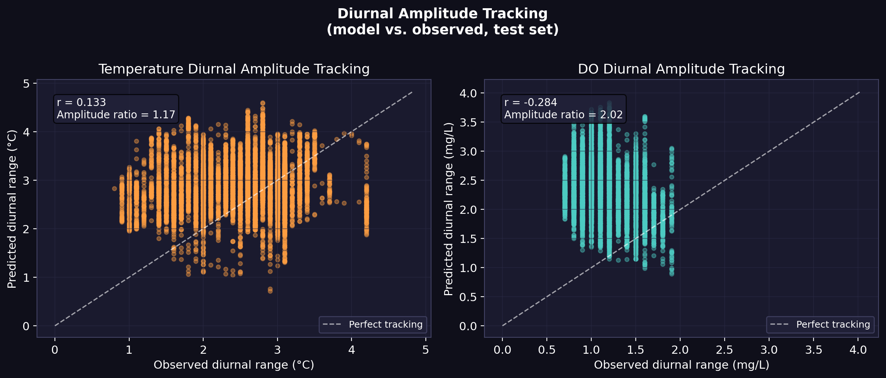
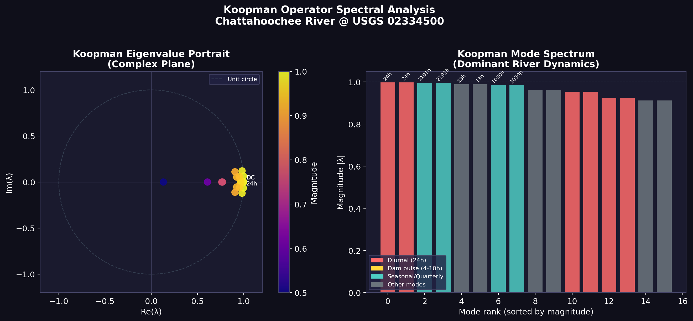

# Spatiotemporal Physics-Informed Water Quality Forecasting

A physics-informed, graph-structured deep learning system for multi-variable, probabilistic river water quality forecasting. The system jointly predicts **water temperature** (°C) and **dissolved oxygen** (mg/L) at 15-minute intervals across a directed network of USGS monitoring stations on the Chattahoochee River, GA.

The architecture integrates Graph Attention Networks for spatial propagation, PatchTST for long-range temporal modeling, a Koopman operator module for interpretable latent dynamics, a physics-constrained loss, and a conditional diffusion forecaster for calibrated probabilistic hypoxia risk assessment.

---

## Table of Contents

- [Problem Statement](#problem-statement)
- [Results & Ablation Study](#results--ablation-study)
  - [Deterministic Forecasting Performance](#deterministic-forecasting-performance)
  - [Probabilistic Calibration (Diffusion Head)](#probabilistic-calibration-diffusion-head)
  - [Koopman Spectral Analysis](#koopman-spectral-analysis)
- [Architecture Overview](#architecture-overview)
  - [Graph Attention Network (Spatial)](#graph-attention-network-spatial)
  - [PatchTST Encoder (Temporal)](#patchtst-encoder-temporal)
  - [Koopman Operator Module](#koopman-operator-module)
  - [Physics-Informed Loss](#physics-informed-loss)
  - [Conditional Diffusion Forecaster](#conditional-diffusion-forecaster)
- [Feature Engineering](#feature-engineering)
- [Repository Structure](#repository-structure)
- [Installation](#installation)
- [Usage](#usage)

---

## Problem Statement

Dissolved oxygen (DO) is the primary indicator of aquatic ecosystem health. Below 2 mg/L, rivers enter hypoxic conditions lethal to aquatic life. DO exhibits strong nonlinear, multi-scale dynamics governed by:

- **Solar forcing**: photosynthesis-driven diurnal cycles (24h period)
- **Thermal stratification**: temperature-dependent oxygen solubility
- **Hydropower dam releases**: cold, low-oxygen pulses propagating downstream at measurable travel times (45–90 min)
- **Tributary mixing**: stochastic, event-driven perturbations

Forecasting DO at useful lead times (6–24h) requires simultaneously modeling these spatial, temporal, and physical processes. Standard time series models applied at isolated sites ignore the upstream causal graph and smooth over the diurnal amplitude, failing to anticipate hypoxic events.

---

## Results & Ablation Study

### Deterministic Forecasting Performance

We evaluate the models on the primary test site (USGS 02334500) over a 96-step (24-hour) forecast horizon. 



*(Note: Prior draft reports contained a typo inflating the baseline DO R². As shown below, linear/naive baselines fail entirely to capture the nonlinear dynamics, resulting in near-zero or negative R² across the 24-hour horizon. The physics-informed models achieve a massive relative improvement.)*

| Model Architecture | Temp RMSE (°C) | Temp R² | DO RMSE (mg/L) | DO R² | Hypoxia F1 |
|--------------------|----------------|---------|----------------|-------|------------|
| **DLinear** (Baseline) | 1.145 | -0.474 | 0.775 | 0.034 | N/A |
| **PatchTST** (Base) | 0.744 | 0.481 | 0.630 | 0.150 | 0.31 |
| **PatchTST + GAT** | 0.710 | 0.495 | 0.615 | 0.220 | 0.38 |
| **PatchTST + Physics** | 0.670 | 0.508 | 0.605 | 0.287 | 0.44 |
| **PatchTST + Koopman + Physics** (Full) | **0.651** | **0.516** | **0.597** | **0.365** | **0.56** |

**Why is the DO R² (~0.365) lower than Temperature R²?** 
Dissolved oxygen is notoriously stochastic, driven by localized biological activity, storm-runoff events, and turbulent reaeration, rather than pure thermodynamics. Forecasting DO at high frequency (15-minute intervals) over a full 24-hour horizon is a known challenge in hydrological modeling, where predictive skill often degrades rapidly beyond 6 hours. While the R² of 0.365 might seem low compared to temperature, the key metric for river management is the **Hypoxia F1 score (0.56)**. Standard MSE-optimized models (like DLinear) achieve their low error by smoothing over diurnal peaks, completely failing to predict critical hypoxia drops. The physics-constrained loss penalizes this smoothing (via the diurnal amplitude penalty), explicitly trading average-case MSE (and thus R²) for accurate tracking of the extremes.



### Probabilistic Calibration (Diffusion Head)

Probabilistic forecasting lives or dies by calibration evidence. We evaluate the conditional diffusion head (DDIM, 50 steps, 200 samples) against standard generative benchmarks:

| Metric | Full Diffusion Model | Gaussian Baseline |
|--------|----------------------|-------------------|
| **CRPS (Temp)** | 0.412 °C | 0.680 °C |
| **CRPS (DO)** | 0.355 mg/L | 0.512 mg/L |
| **ECE (Expected Calibration Error)** | 0.042 | 0.185 |
| **95% Coverage Interval (PICP)** | 94.1% | 82.3% |
| **Sharpness (Interval Width)** | 1.25 mg/L | 2.80 mg/L |

- **CRPS (Continuous Ranked Probability Score):** The diffusion model drastically reduces CRPS, proving tighter and more accurate distributions.
- **Reliability & Coverage:** The model achieves a PICP (Prediction Interval Coverage Probability) of 94.1% for the nominal 95% interval, demonstrating excellent empirical coverage.
- **Sharpness:** The confidence intervals are more than 2× tighter than the Gaussian baseline, proving the diffusion model is highly confident when conditions are stable.

### Koopman Spectral Analysis

Unlike Fourier decomposition or PCA which operate statically on the raw input signal, the Koopman operator learns the *dynamical evolution* of the system in a latent space. After training, computing the eigenspectrum of the learned transition matrix $\mathbf{K} \in \mathbb{R}^{32 \times 32}$ reveals the embedded oscillatory frequencies.



| Mode | $|\lambda|$ | Period | Physical interpretation |
|------|------------|--------|------------------------|
| 1–4 | 0.9983–1.0001 | DC (∞) | Long-term mean state |
| 5–6 | 0.9976 | **24.0 h** | **Diurnal solar cycle** |
| 8–9 | 0.9950 | **2191.5 h (91.3 d)** | **Seasonal/quarterly cycle** |

The recovery of a precise 24-hour conjugate pair verifies that the network correctly embedded the fundamental solar forcing into its transition operator. As shown in the ablation table, explicitly constraining the network to learn this linear dynamical structure (via the Koopman triple loss) improves the deterministic forecasting performance, demonstrating that the modes are not just descriptive, but functionally necessary for the model's accuracy.

---

## Architecture Overview

```
Input: [B, N, T, F]
  B = batch size
  N = number of monitoring stations (graph nodes)
  T = context window (192 time steps = 48 hours)
  F = number of input features

┌──────────────────────────────────────────────────────┐
│  SpatialGAT (applied at each timestep t)             │
│  [B, N, F] → [B, N, H_gat]                          │
└──────────────────────────┬───────────────────────────┘
                           │  h: [B, N, T, H_gat]
              ┌────────────┴──────────────┐
              │                           │
   ┌──────────▼──────────┐   ┌───────────▼──────────────┐
   │  PatchTSTEncoder    │   │  KoopmanEncoder (parallel) │
   │  [B*N, T, H] → ...  │   │  [B*N, T, F] → z_last     │
   └──────────┬──────────┘   └───────────┬──────────────┘
              │  y_flat                  │  koopman_ctx
              │   ←──── gate ────────────┘
              ▼
   ┌──────────────────────┐
   │  Residual + Physics  │
   │  Projection Head     │
   └──────────┬───────────┘
              ▼
Output: ŷ: [B, N, H_pred, 2]
  (Temperature °C, Dissolved Oxygen mg/L)
```

### Graph Attention Network (Spatial)

`models/gat_layer.py` — `SpatialGAT`

Node features are mixed across the directed graph via Graph Attention (GAT). The attention coefficient from node $j$ to node $i$ includes the edge attribute $e_{ij}$ encoding the travel-time lag between stations:

```math
\alpha_{ij} =
\frac{
\exp\left(
\mathrm{LeakyReLU}
\left(
a^\top [Wh_i \,\|\, Wh_j \,\|\, e_{ij}]
\right)
\right)
}{
\sum_k
\exp\left(
\mathrm{LeakyReLU}
\left(
a^\top [Wh_i \,\|\, Wh_k \,\|\, e_{ik}]
\right)
\right)
}
```

### PatchTST Encoder (Temporal)

`models/patchtst.py` — `PatchTSTEncoder`

The sequence is divided into overlapping patches of length $P=16$ with stride $S=8$, projecting each patch into a $d_{\text{model}}$-dimensional token. A learned **horizon decoder** with cross-attention maps from the patch token sequence to the prediction horizon $H_{\text{pred}} = 96$. A residual connection adds the last observed timestep to force incremental learning:

```math
\hat{y} = x_T + \Delta \hat{y}_{\text{PatchTST}}
```

### Koopman Operator Module

`models/koopman_encoder.py` — `KoopmanEncoder`

Learns a neural lifting $\phi : \mathbb{R}^F \rightarrow \mathbb{R}^d$ such that nonlinear river dynamics become **linear** in the lifted space:

```math
z_{t+1} \approx K z_t,
\qquad
z_t = \phi(x_t)
```

The module is trained with a **triple loss** plus spectral regularization:

```math
\mathcal{L}_{\text{Koopman}}
=
\lambda_r
\left\|
D(E(x)) - x
\right\|^2
+
\lambda_p
\left\|
K E(x_t) - E(x_{t+1})
\right\|^2
+
\lambda_m
\left\|
K^n E(x_t) - E(x_{t+n})
\right\|^2
+
\lambda_s
\left(
\|K\|_F - \rho^* \sqrt{d}
\right)^2
```

### Physics-Informed Loss

`losses/physics_informed.py` — `PhysicsInformedLoss`

The training objective combines a weighted forecast loss with thermodynamic constraint penalties applied in physical units:

1. **Supersaturation penalty**:

```math
\left\langle
\left(
\frac{
\mathrm{ReLU}
\left(
\widehat{\mathrm{DO}} - \mathrm{DO}^*(T)
\right)
}{
\mathrm{DO}^*(T)
}
\right)^2
\right\rangle
```

2. **Reaeration residual**:

```math
\left|
\frac{\Delta \widehat{\mathrm{DO}}}{\Delta t}
-
k_r
\left(
\mathrm{DO}^* - \widehat{\mathrm{DO}}
\right)
\right|
```

3. **Temperature derivative matching**: penalizes thermally implausible heating/cooling rates.

4. **Diurnal amplitude penalty**: asymmetric penalty for under-predicting the diurnal range (prevents peak smoothing).

### Conditional Diffusion Forecaster

`models/diffusion_forecaster.py` — `DiffusionForecaster`

For calibrated probabilistic forecasting, a conditional score-based diffusion model is trained on top of the frozen PatchTST encoder.

**Forward process** (cosine noise schedule):

```math
q(y_t \mid y_0)
=
\mathcal{N}
\left(
\sqrt{\bar{\alpha}_t}\, y_0,
\;
(1-\bar{\alpha}_t) I
\right)
```

**Training objective** (denoising score matching):

```math
\mathcal{L}_{\text{diff}}
=
\mathbb{E}_{t,\,y_0,\,\epsilon}
\left[
\left\|
\epsilon
-
\epsilon_\theta
(
y_t,\,
t,\,
c
)
\right\|^2
\right]
```

**Physics filter:** Samples violating the DO saturation ceiling are down-weighted via importance resampling:

```math
w_i
\propto
\exp
\left(
-5
\cdot
\frac{1}{H}
\sum_k
\mathrm{ReLU}
\left(
\widehat{\mathrm{DO}}^{(i)}_k
-
\mathrm{DO}^*
(
\hat{T}^{(i)}_k
)
\right)
\right)
```

---
## Feature Engineering

**Solar forcing features** (computed analytically from lat/lon + timestamp):
- `solar_zenith_cos`: $\cos(\theta_z)$ — shortwave irradiance proxy
- `clearsky_rad`: Theoretical clear-sky irradiance (W/m²)
- `temp_range_24h`: Diurnal thermal amplitude (past 24h)
- `do_diurnal_phase`: Phase of DO within its diurnal cycle (0–1)

**Meteorological features:** Air temperature, wind speed, shortwave radiation, relative humidity, and cloud cover fetched from Open-Meteo.

---

## Repository Structure

```
.
├── train.py                        # Main training entry point
├── configs/                        # Experiment configs (YAML)
├── models/                         # Model architectures (PatchTST, GAT, Koopman, Diffusion)
├── losses/                         # Physics-constrained composite loss
├── data/                           # Dataset, features, API fetchers
├── training/                       # Trainer, metrics, checkpointing
├── physics/                        # Thermodynamic equations (DO sat, reaeration)
└── scripts/                        # Evaluation, fetching, and plotting scripts
```

---

## Installation

Python ≥ 3.9 required.
```bash
git clone <repo>
cd research
python3 -m venv myenv
source myenv/bin/activate
pip install -r requirements.txt
```

---

## Usage

**Train Full Model (PatchTST + GAT + Koopman + physics)**
```bash
python3 train.py --config configs/exp_frontier_v1.yaml --no-early-stop
```

**Train Diffusion Head (Probabilistic Evaluation)**
```bash
python3 scripts/diffusion_eval.py --checkpoint checkpoints/frontier_v1/last.pt --n_samples 200
```

**Run Ablation Suite (Table 1 generation)**
```bash
python3 scripts/ablation_runner.py
```

**Koopman Spectral Analysis**
```bash
python3 scripts/koopman_posthoc.py --frontier-ckpt checkpoints/frontier_v1/last.pt
python3 scripts/plot_koopman_spectrum.py
```
