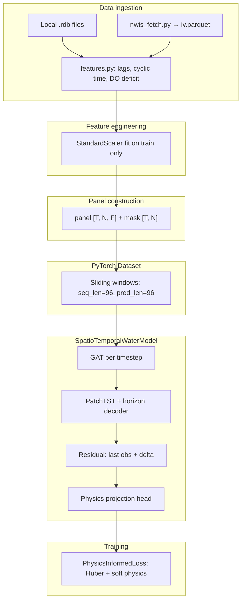

# Physics-Informed Water Quality Forecasting — Project Report

**Last updated:** June 2025  
**Repository:** `/Users/aarushkute/research`  
**Primary config:** `configs/high_accuracy.yaml`  
**Site in production use:** USGS `02334500` (Chattahoochee River near Buford, GA)

This document gives a complete picture of the project objective, current progress, repository layout, and how data flows through the ML system end to end. It is written so someone new to the codebase can understand both the science goals and the implementation.

---

## 1. Overall objective

### 1.1 Mission

Build a **physics-informed machine learning system** that forecasts **water temperature** and **dissolved oxygen (DO)** at USGS monitoring sites over a **24-hour horizon** at **15-minute resolution** (96 input steps → 96 output steps). The system should:

1. **Predict accurately** in physical units (°C, mg/L), capturing diurnal cycles and medium-term trends—not only a smoothed mean.
2. **Respect aquatic chemistry constraints**, especially DO saturation with temperature (Benson–Krause), non-negative DO, and simplified reaeration/dynamics where appropriate.
3. **Scale spatially** via a graph of stations (GAT) when multiple NWIS sites are available.
4. **Support monitoring and research use**, including hypoxia-relevant metrics and optional explainability (attention, Integrated Gradients).

### 1.2 End goal (target state)

| Dimension | Target | Current status |
|-----------|--------|----------------|
| Forecast horizon | 24 h @ 15 min (96 steps) | Implemented |
| Variables | Temperature + DO | Implemented |
| Multi-site GAT | Chattahoochee network | **Single site only** (`N=1`) |
| Test R² (temp / DO) | ~0.75–0.85 (aspirational) | **~0.50 / ~0.51** (latest run) |
| Test RMSE | Low sub-degree temp, sub-0.5 mg/L DO | **0.61 °C / 0.45 mg/L** |
| Physics in **loss** (full curriculum) | Ramped supersaturation, reaeration, derivatives | **Soft mode only; negligible penalty before early stop** |
| Physics at **inference** | DO clamped to [0, DO_sat(T)] | Implemented (`PhysicsProjectionHead`) |
| Operational NWIS pipeline | Auto fetch + multi-site panel | Fetch works; training still 1 site |
| Stable training | No collapse after epoch 3–11 | **Achieved** (improves through ~epoch 27) |

### 1.3 What “success” looks like in practice

- **Validation** `val_phys_mean_rmse` improves monotonically through early training and plateaus at a low value—not a spike when physics or learning rate ramps.
- **Test** metrics in physical units beat a persistence baseline (repeat last observation) by a wide margin.
- **Forecast plots** track observed diurnal peaks and troughs, not only mean level.
- With **multiple sites**, the GAT uses upstream–downstream edges to propagate information along the river network.

---

## 2. Current status summary (June 2025)

### 2.1 Latest full training run

Command:

```bash
python3 train.py --config configs/high_accuracy.yaml
```

| Item | Value |
|------|--------|
| Epochs run | 66 (early stop; budget 150) |
| Best checkpoint (EMA) | **Epoch 31** → `checkpoints/best.pt` |
| Best raw val `val_phys_mean_rmse` | **~0.56** at epoch 27 |
| Early-stop monitor | `val_phys_mean_rmse` with EMA (`ema_decay: 0.9`) |
| Features | 23 |
| Nodes | 1 |
| Physics loss during run | Logged as `0.0000` (warmup 45 epochs + soft/low scale; stop before heavy physics) |

**Test metrics (physical units, held-out split):**

| Variable | RMSE | MAE | R² |
|----------|------|-----|-----|
| Temperature | 0.614 °C | 0.453 °C | 0.502 |
| Dissolved O₂ | 0.446 mg/L | 0.319 mg/L | 0.509 |

Compared to an earlier unstable run (best at epoch 3: temp R² 0.24, DO R² 0.39), this is a **major stability and accuracy improvement**, but **still short of the aspirational R² 0.75+** goal.

### 2.2 What we learned from training dynamics

1. **Residual baseline + cosine LR + soft physics** fixed the “best at epoch 3 then collapse” pattern.
2. **Plateau after ~epoch 27–31** suggests a local ceiling for single-site, current architecture, and 66 epochs of effective forecast-only training.
3. **Physics-informed loss** did not materially engage before early stopping; inference-time physics projection still applies.
4. **Multi-site GAT** is wired in code but not exercised in the best model (`stations.json` lists one site).

---

## 3. Repository structure

```
research/
├── train.py                 # Main CLI: build data, train, test eval, optional plot
├── model.py                 # Legacy thin wrapper (deprecated TensorFlow baseline)
├── report.md                # This document
├── README.md                # Quick start
├── requirements.txt         # Python dependencies
│
├── configs/
│   ├── high_accuracy.yaml   # ★ Primary: residual + horizon decoder + stable physics curriculum
│   ├── chattahoochee_graph.yaml  # NWIS fetch: sites, HUC, parameters, graph
│   ├── default.yaml         # Original single-site defaults
│   └── long_run.yaml        # 300-epoch long run with periodic checkpoints
│
├── data/
│   ├── dataset.py           # Panel [T,N,F], sliding windows, DataLoaders
│   ├── features.py          # Feature engineering + scalers
│   ├── nwis_fetch.py        # USGS NWIS IV download → parquet per site
│   ├── usgs_rdb.py          # Legacy local .rdb file loader
│   ├── graph_builder.py     # stations.json + edges.csv → PyG edge_index
│   └── raw/
│       ├── stations.json    # Site metadata (currently 1 site)
│       ├── edges.csv        # Upstream/downstream edges (empty / self-loop for N=1)
│       └── 02334500/
│           └── iv.parquet   # NWIS instantaneous values (or iv.csv fallback)
│
├── models/
│   ├── spatiotemporal_model.py  # Top-level module: GAT → backbone → residual → physics head
│   ├── gat_layer.py         # Spatial GAT (PyG) or node_proj when N=1
│   ├── patchtst.py          # Patch embedding + Transformer encoder + horizon decoder
│   ├── horizon_decoder.py   # Cross-attention over horizon queries; coupled temp/DO heads
│   ├── physics_head.py      # Differentiable DO_sat ceiling + non-negativity
│   ├── revin.py             # Reversible instance normalization
│   └── tcn.py               # Optional TCN backbone ablation
│
├── physics/
│   └── do_saturation.py     # Benson–Krause DO_sat(T); reaeration residual helper
│
├── losses/
│   └── physics_informed.py  # Huber forecast loss + horizon weights + physics penalties
│
├── training/
│   ├── trainer.py           # Train/val loop, schedulers, early stop, EMA best, logging
│   ├── evaluate.py          # Test metrics, checkpoint load, model builder
│   ├── metrics.py           # RMSE/MAE/R², hypoxia F1
│   ├── checkpointing.py     # Save/load best, last, epoch_*.pt
│   ├── device.py            # auto → cuda / mps / cpu
│   └── seed.py              # Reproducibility
│
├── scripts/
│   ├── eval_horizon.py      # Per-lead-time RMSE on test set
│   ├── plot_forecast.py     # Sample 24 h forecast figure
│   └── quick_validate.py    # Short training smoke test
│
├── tests/
│   └── test_training_smoke.py  # Dataset build, physics scale, forward pass
│
├── explain/
│   ├── attention_viz.py     # Encoder attention on hypoxia windows
│   └── attribution.py       # Captum Integrated Gradients; optional SHAP
│
├── viz/
│   ├── forecast_plots.py    # Multivariate time-series plots + timestamp helper
│   └── style.py             # Matplotlib publication style
│
├── checkpoints/
│   ├── best.pt              # Best model by EMA val_phys_mean_rmse
│   ├── last.pt              # Latest epoch (resume)
│   ├── run_config.yaml      # Snapshot of config used for run
│   └── epoch_*.pt           # Periodic snapshots (if enabled)
│
├── logs/
│   ├── train_log.csv        # Per-epoch metrics
│   └── train_log.jsonl      # Same, JSON lines
│
├── figures/
│   └── test_forecast_sample.png  # Example test-window plot
│
├── water_temperature.rdb    # Legacy bundled USGS RDB (fallback)
├── disolved_oxygen.rdb      # Legacy bundled USGS RDB (fallback)
│
└── myenv/                   # Python 3.9 virtual environment (local)
```

**Not tracked in git (typical):** `myenv/`, large checkpoints, logs.

---

## 4. End-to-end data flow



### 4.1 Data sources (priority order)

1. **`data/raw/{site_no}/iv.parquet`** — from `python -m data.nwis_fetch --config configs/chattahoochee_graph.yaml`
2. **`iv.csv`** — fallback if pyarrow missing when saving
3. **Root `water_temperature.rdb` + `disolved_oxygen.rdb`** — if no parquet and no `stations.json` path

### 4.2 NWIS fetch (`data/nwis_fetch.py`)

- Pulls USGS instantaneous values (IV) for parameter codes:
  - `00010` temperature (°C)
  - `00300` dissolved oxygen (mg/L)
  - `00060` discharge (optional)
  - `00065` gage height (optional)
- **Discovery modes** (`configs/chattahoochee_graph.yaml`):
  - `seeds_only` — fast; only `seed_sites` (default: `02334500`)
  - `auto` — try HUC, bbox, state catalog (capped by `max_catalog_sites`)
- Writes `stations.json`, `edges.csv`, and per-site `iv.parquet`.
- Normalizes columns to `temperature`, `dissolved_oxygen`, `discharge`, `gage_height`, `datetime`.

### 4.3 Dataset (`data/dataset.py`)

- Builds **`panel`** array `[time, nodes, features]` and **`mask`** `[time, nodes]` (1 = both temp and DO observed).
- **Chronological split:** 70% train / 15% val / 15% test (no shuffle across time).
- Each sample:
  - **`x`:** `[N, seq_len, F]` — 24 h of context
  - **`y`:** `[N, pred_len, 2]` — next 24 h of temperature and DO (scaled)
  - **`forecast_times`:** int64 timestamps for plotting
- **Multi-site:** aligns all sites to a common 15-minute grid; forward-fill short gaps.

### 4.4 Features (`data/features.py`) — 23 columns

**Targets (first two channels, also in feature vector):**

- `temperature`, `dissolved_oxygen`

**Engineered inputs (examples):**

| Group | Features |
|-------|----------|
| Cyclic time | `hour_sin/cos`, `day_sin/cos`, `month_sin/cos` |
| Smoothing / dynamics | `temp_ma_6h`, `temp_ma_24h`, `do_ma_6h`, `temp_diff_1h`, `temp_diff_6h`, `temp_accel_4` |
| Physics-aware | `do_deficit` (= DO_sat − DO), `do_sat_frac` (= DO / DO_sat) |
| Lags | `temp_lag_{4,24,96}`, `do_lag_{4,24,96}` (4/24/96 steps = 1 h / 6 h / 24 h) |
| Optional | `discharge_log`, `gage_height` if present in raw data |

Scalers: **`StandardScaler`** on all feature columns and separate scaler on targets — **fit on train split only**.

---

## 5. Model architecture

### 5.1 High-level equation

For each batch:

```
Input:  x ∈ ℝ^{B × N × T × F}   (T=96, F=23)
Output: ŷ ∈ ℝ^{B × N × H × 2}   (H=96, channels: temp, DO)
```

Pipeline in `SpatioTemporalWaterModel`:

1. **SpatialGAT** — for each timestep, mix features across nodes (for `N=1`, equivalent to a learned linear projection `node_proj`).
2. **PatchTSTEncoder** — temporal modeling with patches + Transformer.
3. **Residual baseline** — `ŷ = last_observation + Δ`, where `Δ` is the network output (critical for diurnal tracking).
4. **PhysicsProjectionHead** — clamp DO in physical space to `[0, DO_sat(T)]`, map back to scaled space.

### 5.2 Spatial GAT (`models/gat_layer.py`)

- **`N > 1`:** PyTorch Geometric `GATConv` on `edge_index` from `edges.csv` / k-NN by latitude.
- **`N = 1`:** `node_proj` only (no graph convolution). Matches checkpoints and avoids unused PyG parameters.
- Applied **independently at each timestep**, then stacked → `[B, N, T, d_gat]`.

### 5.3 PatchTST backbone (`models/patchtst.py`)

1. **RevIN** — per-series normalization (optional).
2. **Local depthwise conv** — two grouped Conv1d layers for short-term smoothing/detrending.
3. **Patch embedding** — `patch_len=12`, `stride=4` → overlapping patches along time.
4. **Transformer encoder** — `d_model=192`, `n_layers=3`, `n_heads=8`, pre-norm, GELU.
5. **HorizonCrossAttentionDecoder** — see below.

### 5.4 Horizon decoder (`models/horizon_decoder.py`)

- **Learned queries** — one query vector per forecast step (96 queries).
- **Cross-attention** — each query attends to all patch tokens.
- **Coupled heads** — temperature head; DO head takes `[hidden ∥ temp]` (physical coupling).
- **Optional GRU refinement** — autoregressive smoothing over horizon with temp/DO feedback.
- **Residual output mode** — small gain init on heads so `Δ` starts near zero.

### 5.5 Physics projection head (`models/physics_head.py`)

At **every forward pass** (train and inference):

1. Denormalize to °C and mg/L.
2. Keep temperature as predicted.
3. `DO_proj = clip(DO, 0, DO_sat(T))` using Benson–Krause from `physics/do_saturation.py`.
4. Renormalize to scaled target space for loss compatibility.

This is **always active** when `use_physics_head: true`, independent of physics **loss** weight.

### 5.6 Optional: TCN backbone

Set `model.backbone: tcn` for ablation — temporal convolution instead of PatchTST (no horizon decoder path).

---

## 6. Loss function (`losses/physics_informed.py`)

### 6.1 Forecast term

- **Huber loss** in **physical units** (denormalize predictions and targets).
- **Horizon weighting** — `exp(-k / τ)` so nearer lead times weigh more (`horizon_tau=36`).
- **Short-horizon emphasis** — extra weighted loss on first 16 steps; weight `2.0` early in training, `0.75` thereafter.

### 6.2 Physics penalty terms (`physics_mode`)

| Mode | Behavior |
|------|----------|
| `off` | No physics penalty |
| `soft` (current) | Supersaturation + non-negativity only, scaled by curriculum |
| `full` | Also solubility, reaeration residual, temperature derivative matching |

**Curriculum:**

- Epochs `1 … physics_warmup_epochs` (45): scale = 0
- Epochs `45 … 135`: cosine ramp to `physics_max_scale` (0.3)
- After ramp: full soft penalty at 0.3× base lambdas

Because the latest run **stopped at epoch 66**, only a **small fraction** of the ramp applied; logged `phys_loss` rounded to zero.

### 6.3 What is *not* in the loss

- Direct R² optimization.
- Explicit peak/amplitude loss (beyond Huber).
- Multi-site contrastive or graph regularizers.

---

## 7. Training system (`training/trainer.py`)

### 7.1 Optimizer and schedule

- **AdamW**, `lr=3e-4`, `weight_decay=0.02`, `grad_clip=0.5`
- **Scheduler:** `cosine_warmup` — linear warmup 20 epochs, then cosine decay to `min_lr=5e-7`
- (Alternative configs: `onecycle`, `plateau`)

### 7.2 Early stopping and checkpointing

| Setting | Value |
|---------|--------|
| Monitor | `val_phys_mean_rmse` |
| EMA for best | `use_ema_for_best: true`, `ema_decay: 0.9` |
| Patience | 35 |
| Min epochs | 50 |
| Saves | `best.pt`, `last.pt`, optional `epoch_XXXX.pt` |

### 7.3 Logging

- `logs/train_log.csv` — fixed schema: train/val loss, physics violation, per-variable physical RMSE on val, LR, wait, EMA best.
- `checkpoints/run_config.yaml` — frozen copy of training config.

### 7.4 Device

`training.device: auto` → CUDA if available, else **Apple MPS** (Metal), else CPU.

---

## 8. Evaluation and visualization

### 8.1 Metrics (`training/metrics.py`)

Computed in **physical units** after `inverse_targets`:

- Per-variable RMSE, MAE, R²
- Hypoxia event F1 (DO &lt; 2 mg/L threshold) when applicable

### 8.2 Scripts

| Script | Purpose |
|--------|---------|
| `scripts/eval_horizon.py` | RMSE vs forecast lead time (1–96) |
| `scripts/plot_forecast.py` | One test batch → `figures/test_forecast_sample.png` |
| `scripts/quick_validate.py` | ~30-epoch smoke run to `checkpoints/quick_validate/` |

### 8.3 Plotting (`viz/forecast_plots.py`)

- Resolves `forecast_times` from batch tensors (handles DataLoader collation).
- Overlays observed vs predicted temp and DO with hypoxia threshold line.

### 8.4 Explainability (optional)

```bash
python3 train.py --config configs/high_accuracy.yaml --explain_hypoxia
```

- Attention maps on hypoxia windows (`explain/attention_viz.py`)
- Integrated Gradients via Captum (`explain/attribution.py`)
- Optional SHAP (`explain.use_shap: true`)

---

## 9. Configuration reference

### 9.1 `configs/high_accuracy.yaml` (primary)

Key knobs:

```yaml
forecast:
  seq_len: 96      # 24 h context
  pred_len: 96     # 24 h forecast

model:
  backbone: patchtst
  use_residual_baseline: true
  use_local_conv: true
  d_model: 192
  patch_len: 12
  patch_stride: 4

physics:
  physics_mode: soft
  physics_warmup_epochs: 45
  physics_ramp_epochs: 90

training:
  batch_size: 32
  epochs: 150
  lr_scheduler: cosine_warmup
  monitor_key: val_phys_mean_rmse
```

### 9.2 Other configs

- **`default.yaml`** — original single-site, simpler model/loss.
- **`long_run.yaml`** — 300 epochs, OneCycle or plateau options, long checkpoint retention.
- **`chattahoochee_graph.yaml`** — NWIS ingestion only (not training hyperparameters).

---

## 10. How to run (operator playbook)

### 10.1 Environment

```bash
cd /path/to/research
python3 -m venv myenv
source myenv/bin/activate
pip install -r requirements.txt
```

Requires **PyTorch**, **torch-geometric**, **dataretrieval**, **pyarrow**, etc. (see `requirements.txt`).

### 10.2 Refresh NWIS data (optional but recommended)

```bash
python -m data.nwis_fetch --config configs/chattahoochee_graph.yaml
```

### 10.3 Train

```bash
python3 train.py --config configs/high_accuracy.yaml
```

Resume:

```bash
python3 train.py --config configs/high_accuracy.yaml --resume checkpoints/last.pt
```

Disable early stopping:

```bash
python3 train.py --config configs/high_accuracy.yaml --no-early-stop
```

### 10.4 Evaluate and plot

```bash
python3 scripts/eval_horizon.py --checkpoint checkpoints/best.pt
python3 scripts/plot_forecast.py
```

### 10.5 Smoke tests

```bash
python -c "from tests.test_training_smoke import *; ..."
# or
python scripts/quick_validate.py --epochs 30
```

---

## 11. Checkpoint compatibility notes

- Checkpoints store `model`, `optimizer`, `scheduler`, `cfg`, scalers, `epoch`, `best_val`, `wait`.
- **Legacy key remap:** `gat.lin.*` → `gat.node_proj.*` for old single-site runs (`training/evaluate.py`).
- **Architecture changes** (residual baseline, local conv, 23 features) require **retraining**; do not load very old weights into the current model without matching config.

---

## 12. Gap analysis: objective vs today

### 12.1 Completed

- [x] PyTorch spatiotemporal pipeline (GAT + PatchTST + horizon decoder)
- [x] 24 h / 15 min forecasting windowing
- [x] Rich feature engineering + physics-aware inputs (`do_deficit`, `do_sat_frac`)
- [x] Physics projection at inference (DO saturation cap)
- [x] Composite loss with curriculum (soft/full modes)
- [x] Physical-unit validation and early stopping on `val_phys_mean_rmse`
- [x] NWIS fetch with seed-site and catalog fallbacks
- [x] Stable training (no OneCycle + hard-physics collapse)
- [x] Test R² ~0.5 for both variables (2× improvement on temperature vs unstable run)
- [x] Logging, checkpointing, resume, plotting with real timestamps

### 12.2 Partial / in progress

- [ ] **Multi-site training** — infrastructure exists; only one site in `stations.json`
- [ ] **Full physics loss** — ramp designed but not fully exercised before early stop
- [ ] **Peak/trough fidelity** — R² ~0.5; primary cause is missing meteorological forcing (solar radiation, air temperature)
- [ ] **Discharge/stage features** — fetched when available; not always in panel
- [x] **Meteorological forcing (Initiative 01)** — `data/meteo_fetch.py`, 5 meteo features in `features.py`, future covariates in horizon decoder; retrain pending

### 12.3 Not yet started / aspirational

See **[FRONTIER_ROADMAP.md](FRONTIER_ROADMAP.md)** for the full 7-initiative plan toward R² 0.85+.

- [ ] R² 0.75–0.85 on test
- [ ] Multi-site graph + dam causality (Initiative 02)
- [ ] Koopman operator embedding (Initiative 03)
- [ ] Conditional diffusion probabilistic forecasts (Initiative 04)
- [ ] Neural ODE / Mamba backbones (Initiatives 05–06)
- [ ] National water-quality foundation model (Initiative 07)
- [ ] Hypoxia-focused operational validation
- [ ] Production deployment / API

---

## 13. Recommended next steps (priority order)

Aligned with [FRONTIER_ROADMAP.md](FRONTIER_ROADMAP.md):

1. **Retrain with meteo (Initiative 01)** — `python -m data.meteo_fetch --config configs/high_accuracy.yaml`, then `python3 train.py --config configs/high_accuracy.yaml --no-early-stop` through epoch 135+ so physics curriculum completes. Target: temp R² ~0.72, DO R² ~0.62.
2. **Multi-site graph + dam causality (Initiative 02)** — add sites 02334430, 02335000, 02335350, 02335757; travel-time edge features; dam release signal from gage-height ROC.
3. **Extend training past plateau** — if meteo alone plateaus, let physics ramp finish before early stop.
4. **Per-horizon analysis** — `eval_horizon.py` to see if error is dominated by long leads; tune `horizon_tau` / loss weighting.
5. **Compare to persistence** — formal baseline on test split.
6. **Month 2+** — Koopman encoder, diffusion head, backbone ablations per roadmap.

---

## 14. Legacy and deprecated code

| File | Status |
|------|--------|
| `model.py` | Deprecated entry; old TensorFlow LSTM + polynomial DO heuristic |
| `disolved_oxygen.rdb` | Typo in filename preserved for compatibility |
| `configs/default.yaml` | Superseded by `high_accuracy.yaml` for accuracy work |
| GAT `gat.lin` keys | Remapped on load for old checkpoints |

---

## 15. Key equations (reference)

**Benson–Krause freshwater DO saturation** (see `physics/do_saturation.py`):

\[
\ln(\mathrm{DO}_{sat}) = -139.34411 + \frac{1.575701 \times 10^5}{T_K} - \frac{6.642308 \times 10^7}{T_K^2} + \cdots
\]

where \(T_K = T_{^\circ C} + 273.15\).

**Simplified reaeration residual** (full physics mode):

\[
\frac{d\mathrm{DO}}{dt} \approx k_{reaer} \cdot (\mathrm{DO}_{sat}(T) - \mathrm{DO})
\]

Penalty: mean squared difference between finite-difference \(\Delta \mathrm{DO}/\Delta t\) and target rate.

**Residual forecast:**

\[
\hat{y}_{t+h} = y_t + \Delta_\theta(x_{t-T:t})
\]

---

## 16. Contact points in code (quick index)

| Question | Where to look |
|----------|----------------|
| How is a batch built? | `data/dataset.py` → `SpatioTemporalWaterDataset.__getitem__` |
| How is the model wired? | `models/spatiotemporal_model.py` → `forward` |
| What loss is used? | `losses/physics_informed.py` → `PhysicsInformedLoss.__call__` |
| How is best model chosen? | `training/trainer.py` → EMA on `val_phys_mean_rmse` |
| How to load and evaluate? | `training/evaluate.py` → `load_model_from_checkpoint` |
| NWIS download failures? | `data/nwis_fetch.py` → `discover_sites`, `seeds_only` mode |
| Plot timestamps wrong? | `viz/forecast_plots.py` → `resolve_forecast_datetimes` |

---

*This report reflects the codebase and the training run that produced test metrics: temp RMSE 0.614 °C, DO RMSE 0.446 mg/L, R² ≈ 0.50 for both variables, with best checkpoint at epoch 31 (`checkpoints/best.pt`).*
